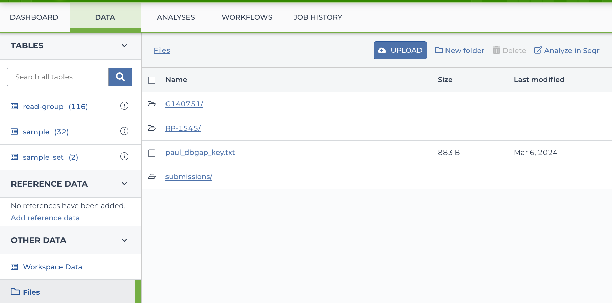

# Submissions 
This repository contains workflows to submit and verify data with two different government repositories: [GDC](https://portal.gdc.cancer.gov/) and [dbGaP](https://www.ncbi.nlm.nih.gov/gap/)

## Submitting Data to GDC
There are two steps to submitting data to the GDC: submission and validation. 
* First, use the [transferToGDC](https://dockstore.org/workflows/github.com/broadinstitute/submissions/transferToGDC:main?tab=info) workflow to transfer your files. The README is located at the bottom of the page at that link, which describes what each input to the workflow is. 
  * Note that read-group level metadata can either be provided in the Terra metadata tables (this should be used for older samples run via Zamboni), OR it can be provided in a JSON file (the `read_group_metadata_json`, which should be used for newer samples run via DRAGEN). 
* After samples have been submitted, their validation status can be checked by using the [validateGDCStatus](https://dockstore.org/workflows/github.com/broadinstitute/submissions/validateGDCStatus:main?tab=info) workflow. This workflow will check each sample's validation status within the GDC and update the Terra metadata tables with the validation status. 

## Submitting Data to dbGaP 
There are two steps to submitting data to dbGapP: submission and validation.
* First, use the [transferToDbgap](https://dockstore.org/workflows/github.com/broadinstitute/submissions/transferToDbgap:main?tab=info) workflow to transfer your files. The README is located at the bottom of the page at that link, which described what each input to the workflow is.
  * Note that read-group level metadata can either be provided in the Terra metadata tables (this should be used for older samples run via Zamboni), OR it can be provided in a JSON file (the `read_group_metadata_json`, which should be used for newer samples run via DRAGEN).
* After samples have been submitted, their validation status can be checked by using the [validateDbGapStatus](https://dockstore.org/workflows/github.com/broadinstitute/submissions/validateDbGapStatus:main?tab=info) workflow. This workflow will check each sample's validation status within dbGaP and update the Terra metadata tables with the validation status.


## Deploying Changes in this Repository 
### When making changes to the .wdl files
Nothing is required if only the .wdl files are changed. Once your branch is merged to `main`, Dockstore will 
automatically get updated with the most recent changes. In your Terra workspace, you can always verify what code is running by looking at the source code (in Terra on GCP, this can be found in the "SCRIPT" tab when you're navigated to your workflow configuration page). 

### When making changes to the Python files
If you've made a change to your Python file, you'll need to recreate and push the appropriate docker image(s). To 
figure out what images need to be replaced, take a look at the Python files you've edited and where they're called 
in the `.wdl` files. Find the corresponding Docker image in the runtime attributes of the `.wdl` file - this will be 
the image that needs to be rebuilt. The Docker images are located in the [Docker](Docker) subdirectory of this repository.
Below are the commands to build and push the Docker images. They're currently stored in Artifact Registry in the 
[Operations Portal](https://console.cloud.google.com/welcome?project=operations-portal-427515&inv=1&invt=AbyLhw) GCP 
project (`operations-portal-427515`). They're all located within the `submissions` repository. The `submission` 
repository is publicly readable, which means anybody can run the WDLs that reference these images. However, you'll 
need additional permissions to push new images to the repository. If you don't have access, please reach out to the 
Operations Team (`support@pipeline-ops.zendesk.com`). 

#### Building the Docker image
Once you've found the Dockerfile you'll need to re-create, you can use the following commands to build and push the docker images (note, you don't have to necessarily build all three images, but these are the commands to use in case you do): 
```commandline
docker build -t us-central1-docker.pkg.dev/operations-portal-427515/submissions/submission_aspera:latest -f Docker/Aspera/Dockerfile . --platform="linux/amd64"

docker build -t us-central1-docker.pkg.dev/operations-portal-427515/submissions/submission_v2:latest -f Docker/V2/Dockerfile . --platform="linux/amd64"

docker build -t us-central1-docker.pkg.dev/operations-portal-427515/submissions/submission_v1:latest -f Docker/V1/Dockerfile . --platform="linux/amd64"
```
You'll need to add the `--platform="linux/amd64`  in case your default platform is different on your machine. 
Once you've successfully created the Docker image, you can run `docker images` and you should see a newly created image. If you're like to verify anything, you can open the image in an interactive shell. First run `docker images` and copy the `IMAGE ID` of your new image. Next run `docker run -it {IMAGE_ID}`. This opens an interactive shell where you can run regular unix commands such as `cd`, `grep`, `vim`, etc.

#### Pushing your new Docker image
Once you're recreated your image and verified that your changes have propagated locally, you'll need to push your 
new image version to Artifact Registry.
You can do so by running any of the following commands (depending on which image you have built and need to push): 
```commandLine
docker push us-central1-docker.pkg.dev/operations-portal-427515/submissions/submission_aspera:latest
docker push us-central1-docker.pkg.dev/operations-portal-427515/submissions/submission_v2:latest
docker push us-central1-docker.pkg.dev/operations-portal-427515/submissions/submission_v1:latest
```

## SSH Key Creation and Usage Guide
This guide provides instructions for creating an SSH key pair and utilizing it to establish secure connections with dbGaP.

### SSH Key Generation
To generate an SSH key pair, follow these steps:
1. Open a terminal or command prompt.
2. Use the following command:
    ```
    ssh-keygen -t rsa -m PEM -f ./private.openssh
    ```
This command will generate two files in your current directory:
- `private.openssh`: Your private key.
- `private.openssh.pub`: Your public key.

### Linking Your Public Key
Once you have generated your SSH key pair, follow these steps to link your public key:
1. Send your public SSH key (`private.openssh.pub`) to `richard.lapoint@nih.gov`.

### Uploading Your Private Key
After linking your public key, you can upload your private key to the designated workspace.

**Note:** Keep your private key secure and do not share it with anyone.

## Support
For any inquiries or assistance, please contact Nareh Sahakian at `sahakian@broadinstitute.org`.

## Disclaimer
Ensure you follow your organization's security policies and guidelines when managing SSH keys and accessing workspaces.
